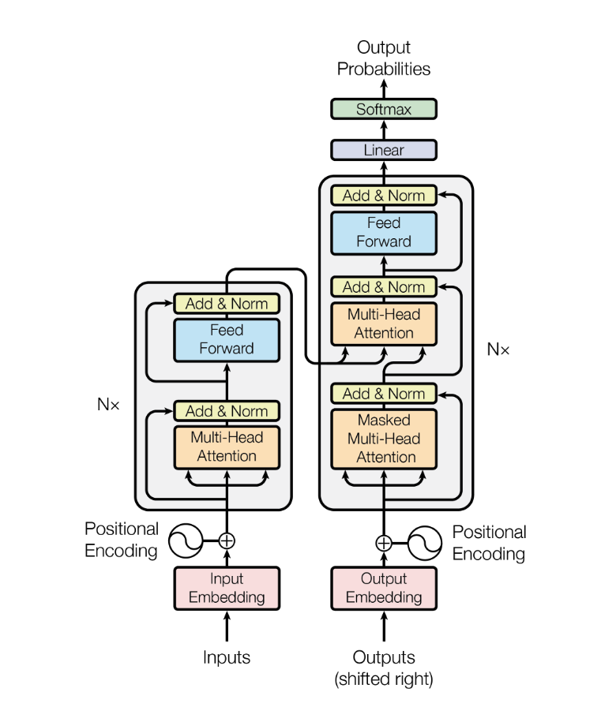
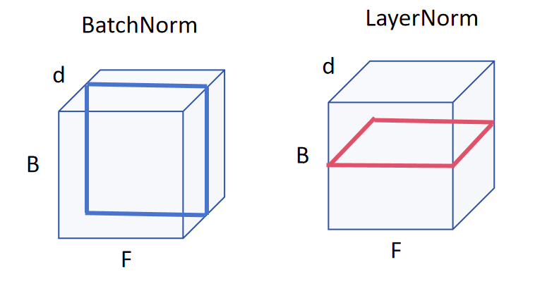

# Transformer — 模型架构

## 1 简介

Transformer 架构主要由编码器和解码器两部分构成, 其中编码器将符号表示组成的输入序列 $x=(x_1,\cdots,x_n)$ 映射为连续表示序列 $z=(z_1,\cdots,z_n)$. 给定 $z$, 解码器**逐个元素**地生成 (自回归) 输出符号序列 $y=(y_1,\cdots,y_m)$.

> 对于一个“英翻中”问题, 输入序列 `x = ['I', 'love', 'math']` , 模型先把它们查表成向量加上位置向量后输入到编码器, 得到序列 `[z1, z2, z3]`, 其中每个 `zi` 都是一个向量, 例如 `z1` 就是单次 `'I'` 的向量表示. 通过解码器得到输出序列 `['我', '爱', '数学']`.

具体地, 编码器由 $N=6$ 个相同的层堆叠而成, 每一层包含两个子层: 其一是多头自注意力机制层, 其二是全连接前馈神经网络层. 在两个子层之后都采用残差连接, 随后用层归一化 (LayerNorm). 即每个子层的输出为
$$
\mathrm{LayerNorm}(x+\mathrm{Sublayer}(x)),
$$
其中 $\mathrm{Sublayer}(x)$ 表示该子层实现的函数. 为了便于层残差连接, 所有子层以及嵌入层的输出维度都设为 $d_{model}=512$.

> LayerNorm 就是对每一个样本做一个标准化, 即对于样本 $x_{i,\cdot}$, 计算它所有特征的均值 $\mu_i$ 和标准差 $\sigma_i$, 则
> $$
> \mathrm{LayerNorm}(x_i)=\frac{x_{i,\cdot}-\mu_i}{\sigma_i}.
> $$
> 与之对应的有 BatchNorm, 它是对每个特征做标准化, 即对于特征列 $x_{\cdot,j}$, 计算列均值和标准差 $\mu_j,\sigma_j$, 则
> $$
> \mathrm{BatchNorm}(x_{\cdot,j})=\frac{x_{\cdot,j}-\mu_j}{\sigma_j}.
> $$
> 简单来说, 对于二维的输入, LayerNorm 就是对每一行进行标准化, BatchNorm 是对每一列进行标准化.
>
> 对于一个三维的输入, 可以用下面的图形象表示
>
> 
>
> 图片来源：https://www.cnblogs.com/xiaxuexiaoab/p/18325271

解码器同样由 $N=6$ 个相同的层组成. 除了与编码器层相同的两个子层外, 解码器还插入了新的层: 对编码器的输出做多头注意力, 且利用掩码机制使得第 $i$ 个位置的预测只能依赖于 $i$ 之前已知的输出.

## 2 Attention

注意力函数可以描述为: 输入一个查询 (query)、一组键 (key) 值 (value) 对, 然后得到一个输出. 即
$$
\mathrm{Attention}:~(Q,K,V)\to \mathrm{Attention}(Q,K,V),
$$
其中 query、key、value 与输出都是向量, 输出是 value 的加权求和, 每个 value 的权重由 query 与对应 key 求得, 事实上就是 query 与 key 之间的相似度.

### 2.1 缩放点积注意力 (Scaled Dot-Product Attention)

本架构采用的是缩放点积注意力, 即用向量的内积来衡量向量之间的相似度. 

- 输入: 维数为 $d_k$ 的 query 与 key, 维数为 $d_v$ 的 value.

- 一组 query 会打包为矩阵 $Q_{n\times d_k}$, key 和 value 分别打包为矩阵 $K_{m\times d_k},V_{m\times d_v}$.

- 输出:
  $$
  \mathrm{Attention}(Q,K,V)=\mathrm{softmax}\left(\frac{QK^T}{\sqrt{d_k}}\right)V.
  $$

与一般的点积注意力不同, 这里在做内积后还进行了 $1/\sqrt{d_k}$ 的缩放, 主要是为了避免当 $d_k$ 较大时, 可能导致 $QK^T$ 中每一行元素都很大或很小, 可能导致 softmax 以后很接近 $0$ 或 $1$, 这会使得梯度很小.

在解码器中, 增加了 Mask 来防止在当前时间看到之后时间的数据. 具体而言, 在 $t$ 时间, 赋予 $q_t,k_t$ 及其之后的值很大的负数 (例如 $-1\times 10^{10}$), 它在进入 softmax 函数之后会变成几乎为 $0$.

### 2.2 多头注意力 (Multi-Head Attention)

与仅用 $d_{model}$ 维度的一组 $Q,K,V$ 做一次注意力相比, 把 $Q,K,V$ 分别通过不同的可学习线性映射投影到 $h$ 组 $(d_k,d_k,d_v)$ 维度更有效.

对于输入隐状态 $H\in\mathbb R^{n\times d}$ (批量维先忽略)

- 先做三组线性投影到 $h$ 个子空间 (每头维度 $d_k=d_v=d_{model}/h$):
  $$
  Q_i=HW_Q^{(i)},~K_i=HW_K^{(i)},~V_i=HW_V^{(i)}\in\mathbb R^{n\times d_k}.
  $$

- 每个头各自做一次缩放点积注意力:
  $$
  \mathrm{head}_i=\mathrm{softmax}\left(\frac{Q_iK_i^T}{\sqrt{d_k}}\right)V_i\in\mathbb R^{n\times d_k}.
  $$

- 把所有头沿特征维拼接后, 再经一个输出线性变换:
  $$
  \mathrm{MHA}(H)=\mathrm{Concat}(\mathrm{head}_1,\cdots,\mathrm{head}_h)W_O, \quad W_O\in\mathbb R^{(hd_k)\times d}.
  $$
  

## 3 逐位置前馈神经网络 (Position-wise Feed-Forward Networks)

除了注意力子层外, 编码器和解码器的每个层都包含一个逐位置且参数共享的全连接前馈网络:
$$
\mathrm{FFN}(x)=\max(0, xW_1+b_1)W_2+b_2
$$
事实上, 就是对每个 token 的向量 $x_t\in\mathbb R^{d_{model}}$ 执行相同的两次线性变换, 且第一次线性变换后要执行一次激活函数 ReLU. 其中输入与输出维度为 $d_{model}$, 中间层维度为 $d_{ff}=2048$.

## 4 嵌入 (Embedding) 与 Softmax 

用可学习的嵌入把输入/输出 token 映射到 $d_{model}$ 维向量, 并用线性变换 + softmax 把解码器输出转为下一个 token 的预测概率. 在本模型中, 两个嵌入层与 pre-softmax 线性层共用同一套权重, 在嵌入层里, 这些权重还会乘以 $\sqrt{d_{model}}$.

### 4.1 Embedding

设词表集合 $\mathcal V$, 可训练词嵌入矩阵 $E\in\mathbb R^{|\mathcal V|\times d}$. 把序列 $(x_1,\cdots,x_n)$ 查表成矩阵 $H^{(0)}\in\mathbb R^{n\times d}$, 再遇位置向量相加:
$$
H_t^{(0)}=E[x_t]\cdot\sqrt d+P_t.
$$
乘 $\sqrt d$ 目的是让"词向量的方差尺度"与"位置向量"相当, 避免相加时位置信号被淹没或过强.

### 4.2 输出层: 线性层 + softmax

解码器最后一层输出 $H^{(L)}\in\mathbb R^{m\times d}$, 通过线性变换映射到词表维度得到 logits:
$$
\mathrm{logits}=H^{(L)}W_{lm}+b,\quad W_{lm}=E^T\in\mathbb R^{d\times |\mathcal V|}.
$$
softmax 得到下一个 token 的条件分布:
$$
p(y_t=v~\vert~ \cdot)=\mathrm{softmax}(\mathrm{logits}_t)_v, \quad v\in\mathcal V.
$$

## 5 位置编码

为了让模型知道序列的顺序信息, 我们在编码器与解码器将位置编码与输入嵌入相加. 位置编码与嵌入具有相同维度 $d_{model}$, 其既可以学习也可以固定, 本模型采用不同频率的正弦/余弦函数:
$$
PE(pos,2i)=\sin\left(\frac{pos}{10000^{2i/d_{model}}}\right),\quad PE(pos,2i+1)=\cos\left(\frac{pos}{10000^{2i/d_{model}}}\right),
$$
其中 $pos$ 为位置, $i$ 为维度索引.
